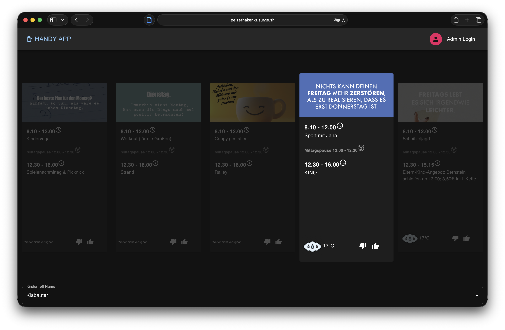

# Pelzerhaken KT

A responsive website project built for a clean, modern presentation across desktop and mobile devices.

## Live Demo

[](https://pelzerhakenkt.surge.sh)

**[Open the live website](https://pelzerhakenkt.surge.sh)**

## About

This project focuses on a simple and user-friendly web experience with a responsive layout and visually structured content.

## Features

- Responsive design for desktop and mobile
- Clean and modern interface
- Image-based content presentation
- Easy navigation
- Publicly deployed website

## Tech Stack

- HTML
- CSS
- JavaScript
- Surge for deployment

## Preview

Click the image above to open the live version of the website.

## Run Locally

Clone the repository:

```bash
git clone <repository-url>
```
